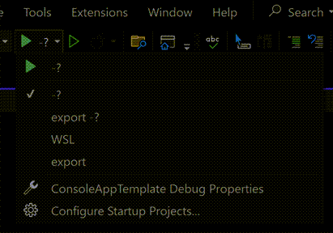

# ConsoleAppTemplate  


## Description  


## Table of Contents  
1. [Description](#description)  
2. [Contents](#contents)  
3. [To Do](#to-do)  
4. [Project](#project)  
5. [Program.cs](#programcs)  
6. [Commandline Arguments](#commandline-arguments)  


# TODOs / Checklist

There are a number of TODO in the code. Some of them are things you will need to do immediately,  
for example, implementing "Your code here". Others are things that you should do before releasing,  
your application. For example, adding descriptions to your application and sub commands. There are  
some things that you may never do, for example,  

To view the list of TODOs, in Visual Studio, under the View menu, select Task List.  


## Project  

1. Set the version of .Net that you want to use
1. Run package restore to get the latest packages - While the packages were updated when this template was made, and periodically updated, it is still best to run update before you get started
1. Set the version number in the project file. See [Semver.org](https://semver.org/) for more information on symantec versioning.  


## Program.cs  

1. Add a name for the application  
1. Add a description of the application  
1. Determine if you are using sub commands or not and update the OnExecute method accordingly. See Sub Commands section on this file for more information this.
1. If you are not using sub commands, and using the OnExecute method with async code, consider changing the singature to `Task<int> OnExecuteAsync (...)`
1. Determine if you are using a single `appSettings.json` file or one per environment. 
See [Setup Config Files](#setup-config-files) section in this file for more information on this.

>**Note**
>
>This template is designed so the application returns 0 on success and a value greater than 0 on failure.
This tells the operating system, or the application that launched this application, that the application has succeeded or failed. 
This is important for applications that are run as part of a pipeline or in a container. 
It is recommended that you follow this approach and use either int OnExecute or 
Task&lt;int&gt; OnExecuteAsync and return 0 if the command succeeds or a value greater than 0 if 
it fails. The template defines a class, `ExistCode` with predefined values including `Success` and `ApplicationError`
You can add additional values to this class.

The template wraps the contents of Main in a try/catch block which will catch any unhandled exceptions and log
them to any defined sinks, write the exception directly to the console and return `ExitCode.UnhandledException`.


## Setup Config Files

This template supports using a single appSettings.config file for all environments or 
sepearate config files, one for each environment. 

### Single File (appSettings.json) vs One File Per Environment (appSettings.&lt;environment&gt;.json)
1. If using a single file for all environements 
	a. You will use the file named `appsettings.json` in the root of your project. 
	a. You can safely delete the other json files, `appsettings.*.json`, i.e. `appsettings.Development.json`, `appsettings.Production.json` etc.
	a. In the Program.cs file make sure that the line UseSingleEnvironment() is uncommented and that the line UseMultiEnvironment() is either commented out or removed

1. If using one file per environment
	a. you can safely delete the file named `appsettings.json` in the root of your project. 
	a. You will keep the other json files, `appsettings.*.json`, i.e. `appsettings.Development.json`, `appsettings.Production.json` etc.
	a. Create a file named for each environment you want to use, i.e. `appsettings.Test.json`, `appsettings.Local.json` etc.
	a. Make sure each file is set to copy to output directory., by right clicking on the file and selecting Properties
	a. Make sure the Windows environment variable `DOTNET_ENVIRONMENT` is set to the environment you want to use. 
	If the variabled does not exist, in blank or contains a value for which you don't have a config file for, an error will occur.
	a. In the Program.cs file make sure that the line UseMultiEnvironment() is uncommented and that the line UseSingleEnvironment() is either commented out or removed

### Loading Settings Into Classes 

When loading settings from a config file, you can add an `IConfiguration` parameter to the OnExecute method and access the settings individually.

```csharp
Task<int> OnExecuteAsync(IConfiguration config)
{
	// Get the setting from the config file
	var setting = config["SettingName"];
	
	// Your code here
}
```

However, it is recommended that you group related settings into a section in the config file, create a class to hold all the values, and then setup the dependecy injection to load the config file into the class
	
AppSettings.json
```json
{
	"Smtp": {
		"Host": "smtp.example.com",
		"Port": "25",
		"UserName": "user",
		"Password": "P4$$w0rd",
		"Timeout": 1000
	}
}
```
		
Class to store the SMTP settings from the config file
```csharp
internal class SmtpSettings
{
	public string Host { get; set; }
	public int Port { get; set; }
	public string UserName { get; set; }
	public string Password { get; set; }
	public int Timeout { get; set; }
}	
```

Configuring dependency inject to load the settings from the config file into the SmptSettings so it can be used later
```csharp
.ConfigureServices((context, collection) =>
{
    collection.AddSingleton<SampleConfiguration>(provider =>
    {
        // Get the configuration from the host builder
        var config = provider.GetService<IConfiguration>();
                        
        // Load SampleConfiguration section from the config file
        var sc =  config.GetSection("SampleConfiguration").Get<SampleConfiguration>();
            return sc;
    });
})
```

Using the SmtpSettings in the OnExecute method
```csharp
Task<int> OnExecuteAsync(SmtpSettings smtpSettings)
{

	var smtpClient = new SmtpClient(smtpSettings.Host, smtpSettings.Port)
	{
		Credentials = new NetworkCredential(smtpSettings.UserName, smtpSettings.Password),
		Timeout = smtpSettings.Timeout
	};

	// Your code here
}
```

### Configure Logging

The config file has several TODOs in it. You should review these and make sure they are set the way you want

TODOs in the file include
- [ ] Adding any connection string should your app need them. If it does not, you can remove the connection string section
- [ ] Adding or removing logging sinks. The template is configured to use the Console and File sinks, but you can remove either or both. For more details see the section on Logging in this document
- [ ] Review and change the minimum logging levels is desired
- [ ] Review and change the path to write log files
- [ ] Add your application's custom settings

## LaunchSettings.json

The launchSettings.json file is used to configure the application when running in Visual Studio. 
You can specify multiple configurations, and each configuration can have its own set of command line arguments.

In the example below there are three profiles. 
1. The first profile will run the program with `-?` option to display the help
1. The second profile will run the `export` subcommand with `-?` option to display the help for the export subcommand
1. The third profile will run the `export` subcommand with the command line argument `export-file.csv` and the commandline option `delimiter`

```json 
{
	"profiles": {
		"-?": {
			"commandName": "Project",
			"commandLineArgs": "-?"
		},
		"export -?": {
			"commandName": "Project",
			"commandLineArgs": "export -?"
		},
		"export": {
			"commandName": "Project",
			"commandLineArgs": "export-file.csv --delimiter=|"
		}
	}
}
```

You can select the profile you want to run in Visual Studio by selecting it from the dropdown list in the toolbar.



# Configuring Your App for Use with the Commandline 


This template uses the McMaster CommandLineUtils library to parse commandline arguments.


## Sub Commands
This template supports sub commands. A sub command is a command that is executed as part of another command. 
For example the dotnet.exe command has sub commands like `dotnet new`, `dotnet build`, `dotnet run` etc. In this case
new, build and run are sub commands of the dotnet command, each supports its own set of command line arguments 
and even other sub commands. 

To configure a sub command, you will need to do the following:
1. Create a class for the sub command in the Command folder
1. You can name the class whatever you want, but it is recommended to name it a verb followed by the word Command. i.e. ExportCommand, FormatCommand, etc.
1. Add the [Command] attribute to the class and set the Name and Description properties
1. Add the [SubCommand] attribute to the Program class. i.e. `[Subcommand(typeof(SampleCommand))]`
1. Add one of the following methods to the class
	a. void OnExecute
	a. int OnExecute
	a. Task OnExecuteAsync
	a. Task&lt;int&gt; OnExecuteAsync
1. Add properties to the class with the `[Argument]` and `[Option]` attributes the command line arguments to the class. 
	```csharp 
	internal class SampleCommand
	{
		[Argument(0, Description = "The name and path of the source file")]
		public string SourcePath { get; set; }

		[Argument(1, Description = "TThe name and path of the destination file")]
		public string DestinationPath { get; set; }

		[Option("-c|--count", Description = "The rows to parse.")]
		public int Count { get; set; }
	
		[Option("-v|--verbose", Description = "Enable verbose output.")]
		public bool Verbose { get; set; }

		public void OnExecute()
		{
			// Your code here
		}
	}

	```


## Response Files

This template supports using response files. A response file is a text file that contains command line arguments.
A response file allows users to save frequently used combinations of command line arguments in a file, and then use that file to run the application.
A user can create multiple response files for different purposes, and then use the appropriate response file when running the application.
	

# Logging

This template is configured to use the [Serilog](https://serilog.net/) logging library.
Serilog is a logging library that allows you to log to multiple sinks, including the console, file, and other sinks.
Additional sinks can be found at [Serilog Site]( https://github.com/serilog/serilog/wiki/provided-sinks)

Logging is implmented so that is can be customized via the config file rather than through code.
This allows you to have different settings for different environments if you are using one file per environment. 
It also allows you to change the logging settings to provide more or less detail as situations arise, 
without the need to recompile the application.

However, you can use any logging library as long as it supports the Microsoft.Extensions.Logging library.
To use a different logging library, you will need to 
- [ ] Remove the Serilog packages 
- [ ] Remove the Serilog configuratuion from the config file
- [ ] Add the package for the logging library you want to use.
- [ ] Add the configuration for the logging library you want to use
- [ ] Update the Program.cs file to use the new logging library


Log settings are in the config file starting in the `Serilog` section. This section must be in the root level of the config file.

## Serilog Config Settings

### ``Using``

**Possible values**: Any valid sink you have installed

**Default value**: [ "Serilog.Sinks.Console", "Serilog.Sinks.File" ]

This section is used to specify the sinks that you want to use. The template is configured to use 
the Console and File sinks, but you don't have to. You can remove either or both. Although if you
do not have any sinks defined nothing will be logged. You can add any other sinks that you would 
like. A list of sinks can be found at https://github.com/serilog/serilog/wiki/provided-sinks

[!TIP]
You can disable a sink temporarily by removing it from this list. You can still leave the 
configuration in the `WriteTo` section, but it will not be used. 


### `MinimumLevel` 

**Possible values**: `Debug`, `Verbose`, `Information`, `Warning`, `Error` or `Fatal`
**Default value**: `Debug`

This section is used to specify the minimum level of logging that you want to see. 
This affects all sinks, and is the minimum level of logging that will be written to
the sinks. You can customize the minimum level for each sink, independantly, 
but you can only raise the level, never lower it. 

For example, you can make the Console sink
`Warning` but have the minimum for all others as `Information`. 

#### `Override`

**Possible values**: Any valid namespace
**Default value**: `Microsoft` and `System`

This section is used to override the minimum level for a specific namespace or class.
The template is configured to override anything in the Microsoft and System namespaces 
and log only `Warning` and higher. This is to prevent the logs from being flooded with
information from the .Net libraries. You can remove this section if you want to see all 
logs from the .Net libraries. This might be useful in a dev environment, but it is not 
recommended in production.


### `WriteTo` 

This section is where you configure the sinks that you want to use. The template 
is configured to use the [Console.Sink](https://github.com/serilog/serilog-sinks-console?tab=readme-ov-file#readme)
and [File.Sink](https://github.com/serilog/serilog-sinks-file?tab=readme-ov-file#readme)
sinks, but you can remove either or both.

The exact configuration will depend on the sink you are using. The Console and File sinks
are configured for you as part of this template. 


[!Note]
The `WriteTo` section configures the individual sinks, however, the sink must be 
resgitered in the `Using` section. If it is not registered in the `Using` section, 
or the appropriate package is not installed, the sink will not work. 


### `Enrich`

This section is used to add additional information to the logs. The exact configuration
will depend on the enrichers you are using. In addition, you can add your own custom
properties which will be written to the logs.


# Credits
This template uses the following libraries:

- McMaster CommandLineUtils https://natemcmaster.github.io/CommandLineUtils/
- Serilog https://serilog.net/
